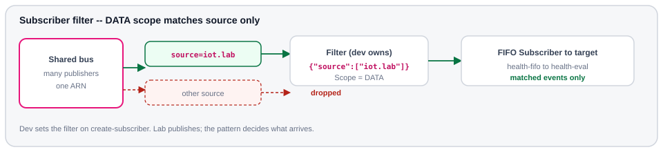

# Deploy dev

Creates the FIFO Subscriber and proof path in **dev** — **AWS CLI only**. Create
the Subscriber **before** smoke traffic (`StartingPosition=LATEST`). Why FIFO
instead of UNORDERED: [Patterns](../patterns.md#unordered-vs-fifo).

Requires `out/lab/bus-arn.txt` from [Deploy lab](lab.md).

## What this creates

| Resource | Detail |
| --- | --- |
| DynamoDB `health-alerts` | Proof store (illustrative consumer) |
| Lambda `health-eval` | OPEN / CLEAR evaluation |
| IAM role `health-eval-role` | Logs + DynamoDB for eval |
| SQS `health-alerts-dlq` | Subscriber on-failure |
| IAM delivery role `eb-subscriber-delivery` | Assumed by EventBridge to invoke eval + DLQ |
| Subscriber `health-fifo` | FIFO on the shared bus — **owns its filter** |

## The filter

Dev owns the filter. Attach to the shared bus, select events, deliver locally.



<p class="diagram-caption"><code>Scope=DATA</code> · pattern <code>{"source":["iot.lab"]}</code> · same <code>Source</code> as the bridge and Verify.</p>

| Piece | Value |
| --- | --- |
| `Scope` | `DATA` — PutEvents envelope |
| `Pattern` | `source = iot.lab` |
| Owner | **dev** |

!!! note "Filter width = egress"
    Enhanced egress bills what the Subscriber **matches**. A wide (or empty)
    filter pulls more GB into **dev**; a tight pattern keeps egress down.
    Detail: [Cost](../cost.md#same-volume-one-bus-enhanced).

## Load context

!!! tip "Mutation guard"
    These calls create billable / account resources. Tear down when finished.

<div class="run" markdown>

```bash
export AWS_PROFILE=dev AWS_REGION=ap-southeast-2
mkdir -p out/dev
BUS_ARN="$(cat out/lab/bus-arn.txt)"
DEV_ACCOUNT="$(aws sts get-caller-identity --query Account --output text)"
echo "$DEV_ACCOUNT" > out/dev/account-id.txt
echo "$AWS_REGION" > out/dev/region.txt
echo "DEV=$DEV_ACCOUNT"
echo "BUS=$BUS_ARN"
```

```text {.no-copy}
DEV=444455556666
BUS=arn:aws:events:ap-southeast-2:111122223333:event-busv2/lab-events/4af03huoxjozsje2bexey6iw8
```

</div>

## Table + DLQ

<div class="run" markdown>

```bash
aws dynamodb create-table \
  --table-name health-alerts \
  --attribute-definitions AttributeName=entity_id,AttributeType=S \
  --key-schema AttributeName=entity_id,KeyType=HASH \
  --billing-mode PAY_PER_REQUEST \
  --tags Key=Project,Value=eb-enhanced-bus \
  --query TableDescription.TableArn --output text
```

```text {.no-copy}
arn:aws:dynamodb:ap-southeast-2:444455556666:table/health-alerts
```

</div>

<div class="run" markdown>

```bash
aws dynamodb wait table-exists --table-name health-alerts
TABLE_ARN="$(aws dynamodb describe-table --table-name health-alerts --query Table.TableArn --output text)"
echo "$TABLE_ARN" | tee out/dev/table-arn.txt
```

```text {.no-copy}
arn:aws:dynamodb:ap-southeast-2:444455556666:table/health-alerts
```

</div>

<div class="run" markdown>

```bash
DLQ_URL="$(aws sqs create-queue \
  --queue-name health-alerts-dlq \
  --tags Project=eb-enhanced-bus \
  --query QueueUrl --output text)"
echo "$DLQ_URL" | tee out/dev/dlq-url.txt
DLQ_ARN="$(aws sqs get-queue-attributes \
  --queue-url "$DLQ_URL" \
  --attribute-names QueueArn \
  --query Attributes.QueueArn --output text)"
echo "$DLQ_ARN" | tee out/dev/dlq-arn.txt
```

```text {.no-copy}
https://sqs.ap-southeast-2.amazonaws.com/444455556666/health-alerts-dlq
arn:aws:sqs:ap-southeast-2:444455556666:health-alerts-dlq
```

</div>

## Eval role + Lambda

<div class="run" markdown>

```bash
aws iam create-role \
  --role-name health-eval-role \
  --assume-role-policy-document '{
    "Version":"2012-10-17",
    "Statement":[{
      "Effect":"Allow",
      "Principal":{"Service":"lambda.amazonaws.com"},
      "Action":"sts:AssumeRole"
    }]
  }' \
  --tags Key=Project,Value=eb-enhanced-bus \
  --query Role.Arn --output text
```

```text {.no-copy}
arn:aws:iam::444455556666:role/health-eval-role
```

</div>

<div class="run" markdown>

```bash
aws iam put-role-policy \
  --role-name health-eval-role \
  --policy-name health-eval-inline \
  --policy-document "{
  \"Version\": \"2012-10-17\",
  \"Statement\": [
    {
      \"Effect\": \"Allow\",
      \"Action\": [\"logs:CreateLogGroup\", \"logs:CreateLogStream\", \"logs:PutLogEvents\"],
      \"Resource\": \"arn:aws:logs:${AWS_REGION}:${DEV_ACCOUNT}:*\"
    },
    {
      \"Effect\": \"Allow\",
      \"Action\": [\"dynamodb:GetItem\", \"dynamodb:PutItem\", \"dynamodb:UpdateItem\"],
      \"Resource\": \"${TABLE_ARN}\"
    }
  ]
}"
```

```text {.no-copy}
(no output)
```

</div>

## Delivery role

EventBridge assumes this role to invoke `health-eval` and write the DLQ.

<div class="run" markdown>

```bash
aws iam create-role \
  --role-name eb-subscriber-delivery \
  --assume-role-policy-document '{
    "Version":"2012-10-17",
    "Statement":[{
      "Effect":"Allow",
      "Principal":{"Service":"events.amazonaws.com"},
      "Action":"sts:AssumeRole"
    }]
  }' \
  --tags Key=Project,Value=eb-enhanced-bus \
  --query Role.Arn --output text
```

```text {.no-copy}
arn:aws:iam::444455556666:role/eb-subscriber-delivery
```

</div>

<div class="run" markdown>

```bash
EVAL_ROLE_ARN="$(aws iam get-role --role-name health-eval-role --query Role.Arn --output text)"
sleep 10
(cd consumer && zip -q -r ../out/dev/health-eval.zip handler.py)
aws lambda create-function \
  --function-name health-eval \
  --runtime python3.14 \
  --role "$EVAL_ROLE_ARN" \
  --handler handler.handler \
  --timeout 15 \
  --memory-size 256 \
  --zip-file fileb://out/dev/health-eval.zip \
  --environment "Variables={HEALTH_ALERTS_TABLE=health-alerts}" \
  --tags Project=eb-enhanced-bus \
  --query FunctionArn --output text | tee out/dev/eval-fn-arn.txt
```

```text {.no-copy}
arn:aws:lambda:ap-southeast-2:444455556666:function:health-eval
```

</div>

<div class="run" markdown>

```bash
EVAL_FN_ARN="$(cat out/dev/eval-fn-arn.txt)"
DELIVERY_ROLE_ARN="$(aws iam get-role --role-name eb-subscriber-delivery --query Role.Arn --output text)"
aws iam put-role-policy \
  --role-name eb-subscriber-delivery \
  --policy-name eb-delivery-inline \
  --policy-document "{
  \"Version\": \"2012-10-17\",
  \"Statement\": [
    {
      \"Effect\": \"Allow\",
      \"Action\": [\"lambda:InvokeFunction\"],
      \"Resource\": \"${EVAL_FN_ARN}\"
    },
    {
      \"Effect\": \"Allow\",
      \"Action\": [\"sqs:SendMessage\"],
      \"Resource\": \"${DLQ_ARN}\"
    }
  ]
}"
```

```text {.no-copy}
(no output)
```

</div>

## Subscriber config files

Write the filter (and invoke / failure targets) under `out/dev/` so you can
re-open this section later without re-deriving JSON.

<div class="run" markdown>

```bash
cat > out/dev/filter.json <<'EOF'
{
  "Filters": [
    {
      "Scope": "DATA",
      "Pattern": "{\"source\":[\"iot.lab\"]}"
    }
  ]
}
EOF
python3 -m json.tool out/dev/filter.json
```

```text {.no-copy}
{
    "Filters": [
        {
            "Scope": "DATA",
            "Pattern": "{\"source\":[\"iot.lab\"]}"
        }
    ]
}
```

</div>

<div class="run" markdown>

```bash
cat > out/dev/invoke.json <<EOF
{"TargetArn":"${EVAL_FN_ARN}","RoleArn":"${DELIVERY_ROLE_ARN}"}
EOF
cat > out/dev/failure.json <<EOF
{"Arn":"${DLQ_ARN}"}
EOF
cat out/dev/invoke.json
cat out/dev/failure.json
```

```text {.no-copy}
{"TargetArn":"arn:aws:lambda:ap-southeast-2:444455556666:function:health-eval","RoleArn":"arn:aws:iam::444455556666:role/eb-subscriber-delivery"}
{"Arn":"arn:aws:sqs:ap-southeast-2:444455556666:health-alerts-dlq"}
```

</div>

## Create the FIFO Subscriber

This demo uses `--type FIFO` so Verify can prove per-device order (OPEN before
CLEAR). An `UNORDERED` Subscriber on the same bus is valid when order does not
matter — comparison: [Patterns](../patterns.md#unordered-vs-fifo).

| Flag | Value |
| --- | --- |
| `--type` | `FIFO` |
| `--starting-position` | `LATEST` |
| `--filter-configuration` | `out/dev/filter.json` |
| `--invoke-configuration` | eval + delivery role |
| `--on-failure-configuration` | DLQ |

<div class="run" markdown>

```bash
SUB_ARN="$(aws eventsv2 create-subscriber \
  --name health-fifo \
  --event-bus-arn "$BUS_ARN" \
  --type FIFO \
  --starting-position LATEST \
  --filter-configuration file://out/dev/filter.json \
  --invoke-configuration file://out/dev/invoke.json \
  --on-failure-configuration file://out/dev/failure.json \
  --tags Key=Project,Value=eb-enhanced-bus \
  --query SubscriberArn --output text)"
echo "$SUB_ARN" | tee out/dev/subscriber-arn.txt
```

```text {.no-copy}
arn:aws:events:ap-southeast-2:444455556666:subscriber/health-fifo/405xvkvixbukex6mx08fyys5s
```

</div>

If `State` is still `CREATING`, wait until `RUNNING` before publishing:

<div class="run" markdown>

```bash
for i in $(seq 1 40); do
  st=$(aws eventsv2 describe-subscriber --subscriber-arn "$SUB_ARN" --query State --output text)
  echo "subscriber state=$st"
  [[ "$st" == "RUNNING" ]] && break
  sleep 3
done
```

```text {.no-copy}
subscriber state=CREATING
subscriber state=RUNNING
```

</div>

<div class="run" markdown>

```bash
aws eventsv2 describe-subscriber --subscriber-arn "$SUB_ARN" \
  --query '{State:State,Type:Type,EventBusArn:EventBusArn,Filter:FilterConfiguration}' \
  --output json
```

```text {.no-copy}
{
    "State": "RUNNING",
    "Type": "FIFO",
    "EventBusArn": "arn:aws:events:ap-southeast-2:111122223333:event-busv2/lab-events/4af03huoxjozsje2bexey6iw8",
    "Filter": {
        "Language": "EVENT_BRIDGE_PATTERN",
        "Filters": [
            {
                "Pattern": "{\"source\":[\"iot.lab\"]}",
                "Scope": "DATA"
            }
        ]
    }
}
```

</div>

<div class="expect" markdown="0"><span class="pill">State = RUNNING</span><span class="pill">Type = FIFO</span><span class="pill">source = iot.lab</span></div>

To change the filter later without recreating:

<div class="run" markdown>

```bash
aws eventsv2 update-subscriber \
  --subscriber-arn "$(cat out/dev/subscriber-arn.txt)" \
  --filter-configuration file://out/dev/filter.json
```

```text {.no-copy}
(Subscriber summary JSON)
```

</div>

Ordering only holds if publishers set `EventGroupId` ([Design](../design/#publish-and-fifo)).
FIFO vs UNORDERED: [Patterns](../patterns.md#unordered-vs-fifo).

Puts in [Verify](verify.md) must use `Source=iot.lab` or this filter drops them.
Next: [Verify](verify.md).
