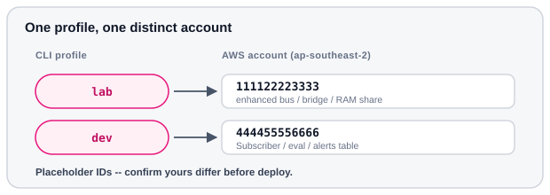

# Check profiles

Confirm `lab` and `dev` resolve to **different** accounts, then write the IDs
under `out/` for the deploy scripts.

Before this page: [Prerequisites](prerequisites.md) (CLI ≥ 2.37.3).



<p class="diagram-caption">Account IDs in the diagram are placeholders. Yours will differ. <code>lab</code> is the same account as the existing <code>sandbox</code> profile.</p>

## Region

<div class="run" markdown>

```bash
export AWS_REGION=ap-southeast-2
```

```text {.no-copy}
(no output)
```

</div>

## Account IDs

<div class="run" markdown>

```bash
aws sts get-caller-identity --profile lab --query Account --output text
```

```text {.no-copy}
111122223333
```

</div>

<div class="run" markdown>

```bash
aws sts get-caller-identity --profile dev --query Account --output text
```

```text {.no-copy}
444455556666
```

</div>

Confirm they are **different** accounts (the share is lab → dev, so same-account
defeats the point):

<div class="run" markdown>

```bash
lab=$(aws sts get-caller-identity --profile lab --query Account --output text)
dev=$(aws sts get-caller-identity --profile dev --query Account --output text)
[ "$lab" != "$dev" ] && echo "ok: lab=$lab dev=$dev" || echo "STOP: same account $lab"
```

```text {.no-copy}
ok: lab=111122223333 dev=444455556666
```

</div>

## Capture for scripts

<div class="run" markdown>

```bash
AWS_PROFILE=lab ./scripts/capture-accounts.sh lab
```

```text {.no-copy}
lab account-id=111122223333 region=ap-southeast-2 profile=lab
```

</div>

<div class="run" markdown>

```bash
AWS_PROFILE=dev ./scripts/capture-accounts.sh dev
```

```text {.no-copy}
dev account-id=444455556666 region=ap-southeast-2 profile=dev
```

</div>

<div class="run" markdown>

```bash
cat out/lab/account-id.txt
```

```text {.no-copy}
111122223333
```

</div>

<div class="run" markdown>

```bash
cat out/dev/account-id.txt
```

```text {.no-copy}
444455556666
```

</div>

[Deploy lab](lab.md) reads `out/dev/account-id.txt` as the RAM share principal
(`--principals`).

## If STS fails

<div class="run" markdown>

```bash
aws sso login --profile lab
```

</div>

<div class="run" markdown>

```bash
aws sso login --profile dev
```

</div>

Then re-run the account ID commands above.

Next: [Deploy lab](lab.md).
