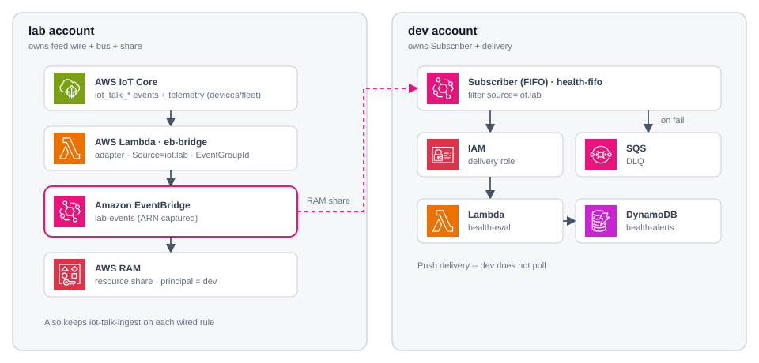
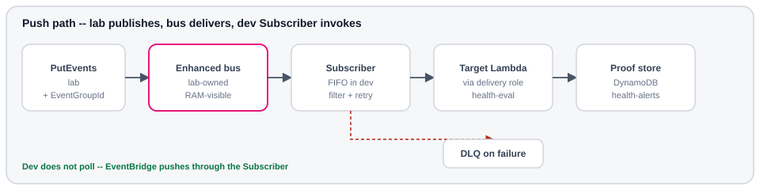
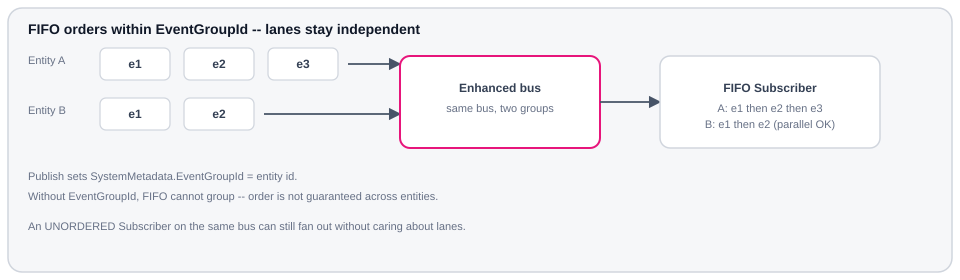

# Design

How the enhanced shared bus is wired: who owns what, how events move, and what
the publish / Subscriber contracts look like.

## Ownership

Lab owns the bus and the RAM share. Dev owns the Subscriber and everything
downstream of it. Management account is out of scope — share is lab → dev only.

Official AWS Architecture Icons. Dashed magenta = AWS RAM. <strong>lab</strong> wires IoT Core → <code>eb-bridge</code> → <code>lab-events</code>. Bus ARN is captured at create into <code>out/lab/bus-arn.txt</code> — never invent it.

| Concern | Account |
| --- | --- |
| Enhanced bus + retention | **lab** |
| RAM resource share (principal = dev) | **lab** |
| Publisher (IoT → `eb-bridge` → `put-events`) | **lab** |
| Subscriber + delivery role + DLQ | **dev** |
| Proof of delivery (target + store) | **dev** |

### Why `eb-bridge` exists

IoT topic-rule actions cannot call `eventsv2 PutEvents` on an enhanced bus
(`event-busv2/...`) with `SystemMetadata.EventGroupId`. The bridge Lambda is
the required adapter — not an optional workaround:

`devices|fleet/+/events|telemetry` → `iot_talk_*` rules → `eb-bridge` → `lab-events`

(Live traffic is mostly **telemetry**; events rules are wired the same way.
Camera stays off the bus.)

It stamps `Source=iot.lab` (Subscriber filter) and `EventGroupId=device_id`
(FIFO). Each wired rule still invokes `iot-talk-ingest`; talk tables stay
untouched. CLI `put-events` in Verify is only a no-device smoke of the same
envelope.

The health-alert target is illustrative. Any Subscriber target works the same
way.

## Consume path

Dev does **not** poll the bus. EventBridge **pushes** through the Subscriber.

Proof that the feature works is a successful invoke in <strong>dev</strong> (this lab: a row in <code>health-alerts</code>). A publisher UI in lab only proves the feed.

## Publish and FIFO

This lab’s publish contract (what `eb-bridge` and Verify stamp):

| Field | Role | Lab value |
| --- | --- | --- |
| `EventBusArn` | Target bus | From `out/lab/bus-arn.txt` |
| `Source` / `DetailType` / `Detail` | Envelope | `iot.lab` / `connectivity` or `button` / JSON |
| `SystemMetadata.EventGroupId` | FIFO key | Entity id (`device_id` for this feed) |

FIFO Subscribers deliver **one `EventGroupId`** in order; different groups stay
independent and can proceed in parallel.

Lab uses FIFO so health-alert state converges. Comparison of FIFO vs UNORDERED (same bus): <a href="patterns/#unordered-vs-fifo">Patterns</a>.

## Subscriber settings

Dev owns the Subscriber, including the filter. Attach to the shared bus, select
events, deliver locally — no bus-owner rule ticket.

<code>Scope=DATA</code> · <code>{"source":["iot.lab"]}</code> · written to <code>out/dev/filter.json</code> in <a href="demo/dev/">Deploy dev</a>.

| Setting | Lab choice | Why |
| --- | --- | --- |
| `--type` | `FIFO` | Prove OPEN → CLEAR order for one entity ([why not UNORDERED](patterns/#unordered-vs-fifo)) |
| `--event-bus-arn` | Shared enhanced bus | Same ARN lab captured at create |
| `--starting-position` | `LATEST` | Demo does not backfill retention |
| `--filter-configuration` | `source = iot.lab` (DATA) | Dev selects; Verify must publish that `Source`. Wider filter → more egress ([Cost](cost.md#same-volume-one-bus-enhanced)) |
| Invoke | `health-eval` via delivery role | Concrete target; swap freely |
| On failure | SQS DLQ | Capture poison / invoke failures |

## Lab consumer (illustrative)

`health-eval` turns connectivity payloads into OPEN / CLEAR rows so verify has
something to read. Thresholds are demo-only:

| Condition | `status` | `reason` |
| --- | --- | --- |
| `rssi < -80` | `OPEN` | `weak_rssi` |
| `chip_temp_c > 55` | `OPEN` | `high_temp` |
| `heap_free < 100000` | `OPEN` | `low_heap` |
| `DetailType=button` | `OPEN` | `attention_button` |
| none of the above (connectivity) | `CLEAR` | `healthy` |

Extra guard: ignore events whose `ts` is older than the stored
`source_event_ts` for that entity (stale replay).

## Naming and tags

Tag everything `Project=eb-enhanced-bus`. Region: `ap-southeast-2`.

| Resource | Name |
| --- | --- |
| Bus | `lab-events` |
| Bridge Lambda / role | `eb-bridge` / `eb-bridge-role` (IoT → bus) |
| RAM share | `eb-enhanced-bus-share` |
| Subscriber | `health-fifo` |
| Eval Lambda | `health-eval` |
| Table / DLQ | `health-alerts` / `health-alerts-dlq` |

Next: [Cost](cost/) for hop vs ingress/egress economics, then [Demo](demo/) to
deploy and verify.
