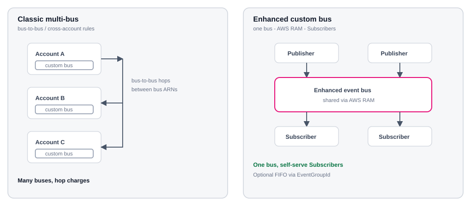
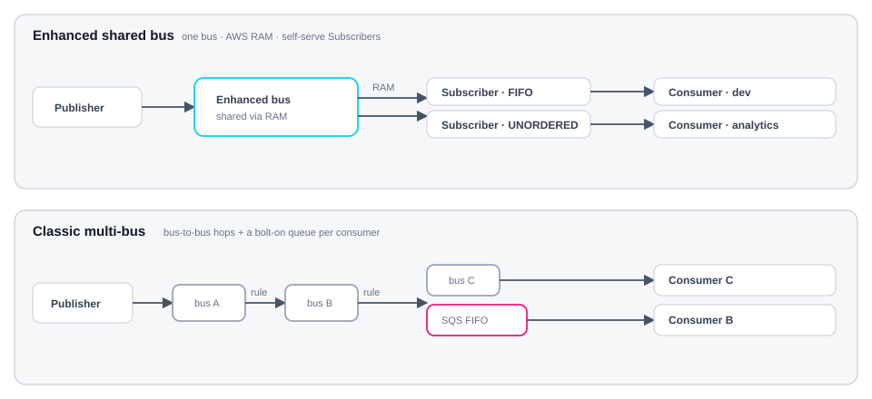
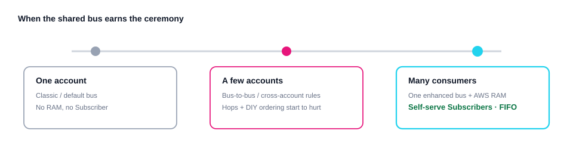
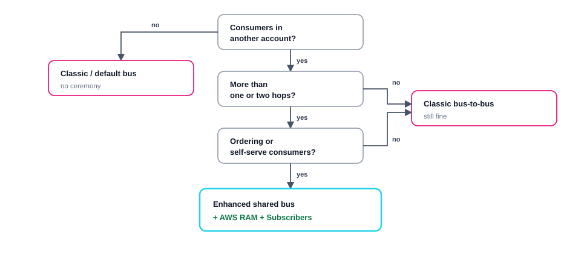
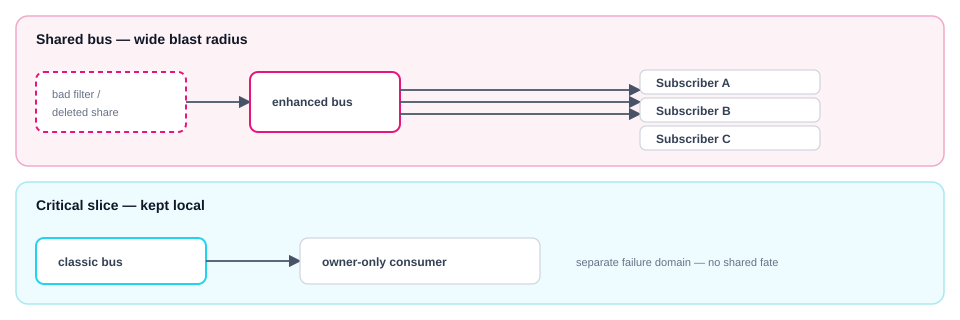
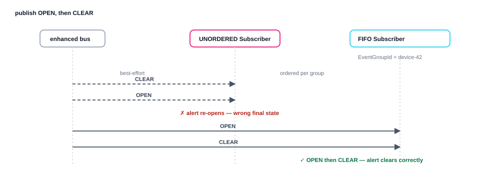

# Patterns

Same job: get events from publishers in one account to consumers in another.

Two shapes — **classic multi-bus** (each account owns a bus; stitch with policies or
bus-to-bus) or **enhanced shared bus** (one bus, AWS RAM, each consumer account
creates its own **Subscriber**).

The question is not which diagram is prettier. It is **when the shared bus earns
the ceremony**.

Left: hop between bus ARNs. Right: one enhanced bus, RAM share, Subscribers attach where they run. Click to zoom.

## The two shapes

### At a glance

Classic grows hops and bolt-on queues per consumer. Enhanced keeps one bus; each consumer account attaches a Subscriber that owns its own filter, ordering, and DLQ. Click to zoom.

### How the footprint grows

The three sections below map to these stages. The shared bus pays off at the right, not the left.

### Which shape, by footprint

Same three stages as a yes/no path: only ordering or self-serve consumers at scale push you onto the enhanced bus.

## 1 · One account — no win yet

Publisher and consumer in the same account: a classic custom bus (or the default
bus) is enough. Rules and targets stay local. No RAM, no Subscriber resource, no
`eventsv2` surface.

Enhanced can do the same work, but you pay for a new ARN shape, retention
settings, and a Subscriber model you do not need yet. Ceremony you do not use.

**Prefer classic.** Enhanced is optional for that footprint.

## 2 · A few accounts — hops start to hurt

The usual scale-up is a bus per account, then cross-account rules or bus-to-bus
targets so events reach the next owner. That works for one or two hops. It gets
expensive and opaque when:

- every new consumer needs the bus owner to add another rule or hop,
- hop charges stack on the path,
- ordered processing means bolting SQS FIFO (or similar) in front of each
  consumer that cares.

At that point you are still solving **routing between buses**, not **sharing one
bus**.

## 3 · Many consumers on one stream — prefer enhanced

  <figure>
    
    <figcaption>one bus</figcaption>
  </figure>
  <figure>
    
    <figcaption>RAM share</figcaption>
  </figure>
  <figure>
    
    <figcaption>FIFO + DLQ</figcaption>
  </figure>
  <figure>
    
    <figcaption>Subscriber target</figcaption>
  </figure>
  <figure>
    
    <figcaption>alert state</figcaption>
  </figure>

Prefer the enhanced shared bus when several of these are true:

| Signal | Why it matters |
| --- | --- |
| Same event stream, many accounts | One bus ARN; RAM principals attach as publishers or Subscribers |
| Consumers want self-serve | A Subscriber is filter + target + retry + DLQ — no bus-owner ticket per rule |
| Mixed ordering needs | FIFO and unordered Subscribers on the **same** bus |
| Retention / replay on the bus | Built-in retention instead of a separate archive story |
| Clearer cost split | Ingress (publish) vs egress (delivery) instead of stacked hop economics — [Cost](cost/) |

That is the shape this site builds: **lab** owns the bus, `eb-bridge`, and the
RAM share; **dev** creates a Subscriber. Worked hop-vs-GB sketch: [Cost](cost/).

| | Classic (`aws events`) | Enhanced (`aws eventsv2`) |
| --- | --- | --- |
| Cross-account | Bus policy / bus-to-bus | **RAM share** of one bus |
| Consumer unit | Rules + targets | **Subscriber** |
| Event selection | Often bus-owner rules | **Consumer DATA filter** on the Subscriber |
| Ordering | DIY (often SQS FIFO) | FIFO Subscriber + `EventGroupId` |
| Retention | Archives (optional) | Built-in retention |
| Bus ARN | `event-bus/<name>` | `event-busv2/<name>/<generated-id>` |

Classic buses remain available as **Custom event bus – classic**. This lab creates
only the enhanced bus.

## 4 · Sharing is not free

A shared bus concentrates the control plane the way a shared DNS hub does.

One misconfig on the shared bus reaches every Subscriber. Keep fate-sensitive streams on a separate bus — mixing shared and local is the normal design, not a failure.

**Blast radius.** A bad filter, deleted share, or bus misconfig can affect every
Subscriber on that bus. Classic multi-bus keeps failure domains closer to each
account — at the cost of hops.

**Who owns the bus.** Someone must own create, retention, and the RAM share
(here: lab). Consumer accounts own their Subscribers and delivery IAM (here: dev).
Do not pretend “self-serve” means “no owner.”

**Escape hatch.** Keep a classic bus (or a second enhanced bus) for streams that
must not share fate with the backbone. Most traffic on the shared bus; critical
slices stay local. Mixing is normal — forcing everything onto one bus is not.

## UNORDERED vs FIFO

Both Subscriber types attach to the **same** enhanced bus. Choose per consumer —
not per bus.

| Type | Prefer when | Requirement |
| --- | --- | --- |
| `UNORDERED` | Fan-out, analytics, best-effort — delivery order does not matter | None |
| `FIFO` | Per-entity sequence must hold (OPEN before CLEAR, step N before N+1) | Publishers set `SystemMetadata.EventGroupId` |

Same two events (`OPEN` then `CLEAR` for one device), delivered two ways:

UNORDERED can deliver CLEAR before OPEN and leave a stuck alert. FIFO keyed by <code>EventGroupId</code> holds per-device order so state converges.

Without `EventGroupId`, FIFO cannot group — you lose the ordering guarantee.
Do not make every Subscriber FIFO “just in case”; you pay ordering constraints
for no gain. An unordered Subscriber on the same events is valid.

This demo uses one **FIFO** Subscriber (`health-fifo`) so Verify can prove
OPEN → CLEAR → button order. Lab contract: [Design](design/#publish-and-fifo).
CLI: [Deploy dev](demo/dev/#create-the-fifo-subscriber).

## Publish APIs

| API | Prefer when |
| --- | --- |
| `put-events` | Familiar Source / DetailType / Detail envelope (this lab) |
| `put-raw-events` | Raw or CloudEvents payloads |

Bridge and verify use `put-events` only.

## What we skip on purpose

Content-based deduplication and JSONata reshape exist on the enhanced bus. They
are not required to prove **RAM share + Subscriber + optional FIFO**.

Next: [Design](design/) for the resource map, [Cost](cost/) for hop vs GB
economics, then [Demo](demo/) for the CLI path.
